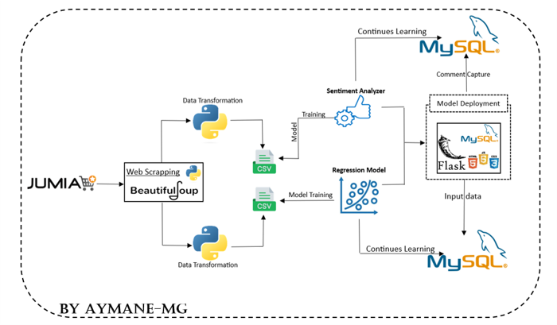

# Sentiment-Analysis-for-Jumia-Reviews-Smartphone-Price-Prediction-System

## Table of Contents
1. [Project Overview](#1-project-overview)
2. [Technologies Used](#2-technologies-used)
3. [Architecture](#3-architecture)
4. [Repository Structure](#4-repository-structure)
5. [How to Run](#5-how-to-run)
6. [Acknowledgments](#6-acknowledgments)
7. [Conclusion](#7-conclusion)
8. [Contacts](#8-contacts)

## 1. Project Overview
The project focuses on developing a system based on customer sentiment analysis. The main challenge is to assist potential customers in making informed decisions about online purchases by evaluating the satisfaction of current users. Data for this task is sourced from the Jumia website. The goal is to collect and analyze customer comments on various products to determine the associated sentiments (positive/negative). The algorithm is then implemented to aid customers in decision-making, such as recommending or not recommending a product based on the trained model. If time permits, a small web application will be simulated where products and comments are displayed, and clicking on a product captures and analyzes the comments, providing a recommendation.

In addition to the sentiment analysis system, the project also includes a product price prediction system for Jumia using regression techniques.

## 2. Technologies Used
- **Jupyter notebook**
- **Python**
- **NumPy**
- **Pandas**
- **Matplotlib**
- **Seaborn**
- **BeautifulSoup**
- **Scikit-learn**
- **Flask**
- **HTML, CSS, JavaScript, MySQL** (for web application)


## 3. Architecture
- Here is the architecture :
- 

## 4. Repository Structure
``` bash   
Sentiment-Analysis-for-Jumia-Reviews-Smartphone-Price-Prediction-System
│   README.md
│
├───images
│       app_web_1_recommendation_systrem.png
│       app_web_2_prediction_system.png
│       architecture.png
│
├───Main
│   ├───Sentiment_Analysis_for_Jumia_Reviews
│   │   │   EDA_and_data_Cleaning.ipynb
│   │   │   final_data.csv
│   │   │   model.pkl
│   │   │   model_tfidf.pkl
│   │   │   Sentiments Analysis Model.ipynb
│   │   │
│   │   ├───.ipynb_checkpoints
│   │   │       EDA_and_data_Cleaning-checkpoint.ipynb
│   │   │
│   │   ├───Data Collection
│   │   │   │   cleaned_data_tp6.csv
│   │   │   │   final_data.csv
│   │   │   │   jumia_comments.csv
│   │   │   │   make_final_data.ipynb
│   │   │   │
│   │   │   ├───.ipynb_checkpoints
│   │   │   │       make_final_data-checkpoint.ipynb
│   │   │   │
│   │   │   └───web scrapping
│   │   │       │   Comments_scraping.ipynb
│   │   │       │   jumia_comments.csv
│   │   │       │   links.txt
│   │   │       │
│   │   │       └───.ipynb_checkpoints
│   │   │               Comments_scraping-checkpoint.ipynb
│   │   │
│   │   └───Web_App_Recommendation
│   │       │   app.py
│   │       │   clean_comment.py
│   │       │   comments_classification.py
│   │       │   model.pkl
│   │       │   model_tfidf.pkl
│   │       │   translate_comment.py
│   │       │
│   │       ├───models
│   │       │       model.pkl
│   │       │       model_tfidf.pkl
│   │       │
│   │       ├───static
│   │       │   ├───css
│   │       │   │       style.css
│   │       │   │
│   │       │   ├───js
│   │       │   │       script.js
│   │       │   │
│   │       │   └───uploads
│   │       │           1.jpg
│   │       │           2.jpg
│   │       │           Apple iPhone 15 Pro.jpg
│   │       │           Apple Watch.jpg
│   │       │           apple.jpg
│   │       │           clavie.jpg
│   │       │           logo.png
│   │       │           Redmi-A2-Blue.png
│   │       │           Samsung a34.jpg
│   │       │           Samsung_Galaxy.jpg
│   │       │           XIAOMI Redmi Note 12.jpg
│   │       │
│   │       ├───templates
│   │       │       index.html
│   │       │
│   │       └───__pycache__
│   │               clean_comment.cpython-310.pyc
│   │               comments_classification.cpython-310.pyc
│   │               translate_comment.cpython-310.pyc
│   │
│   └───Smartphone_Price_Prediction_System
│       │   best_model.pkl
│       │   EDA_smartphone_Data.ipynb
│       │   jumia_mobile_phone.csv
│       │   Regression_Model.ipynb
│       │   smartphone_Data.csv
│       │   Smartphone_data_transformation.ipynb
│       │   smartphone_Data_with_mean_price.csv
│       │
│       ├───.ipynb_checkpoints
│       │       EDA_smartphone_Data-checkpoint.ipynb
│       │       Regression_Model-checkpoint.ipynb
│       │       Smartphone_data_transformation-checkpoint.ipynb
│       │
│       ├───Data Collection
│       │       jumia_mobile_phone.csv
│       │       Mobile_phone_data_scraping.py
│       │
│       └───Web_App_prediction
│           │   app.py
│           │   continues_learning.py
│           │   data_encoding.py
│           │   insert_Data_mysql.py
│           │
│           ├───models
│           │       xgb_model.pkl
│           │
│           ├───static
│           │   ├───css
│           │   │       b3.png
│           │   │       style2.css
│           │   │
│           │   └───js
│           │           script2.js
│           │
│           ├───templates
│           │       index.html
│           │
│           └───__pycache__
│                   data_encoding.cpython-310.pyc
│                   insert_Data_mysql.cpython-310.pyc
│
└───Memory
        Machine Learning Project Final Writeup.pdf
        Pre_ML.pptx
                    
```
- In the memory folder you will find the presentation (ppt file) that I presented in the class, and also you will find the report (pdf file) as a research paper which Contain the details of this project (from data collection to model deploying)

## 5. How to Run

- Clone  the repositeru by this command :
``` bash 
 git clone git@github.com:aymane-maghouti/Sentiment-Analysis-for-Jumia-Reviews-and-Smartphone-Price-Prediction-System-.git 
```

### Sentiment Analysis and Recommendation System Web Application:
- Here is the architecture of the Recommendation System  :
- 


1. Install the required Python libraries:
   ```bash
   pip install numpy pandas  scikit-learn flask xgboost mysql.connector pickle
   ```

2. Navigate to the `/Main/Sentiment_Analysis_for_Jumia_Reviews/Web_App_Recommendation` directory:
   ```bash
   cd Main/Sentiment_Analysis_for_Jumia_Reviews/Web_App_Recommendation
   ```

3. Run the Flask application:
   ```bash
   python app.py 
   ```

4. Access the web application for the recommendation system at [http://localhost:5000](http://localhost:5000).

### Price Prediction System Web Application:

- Here is the architecture of the Price Prediction System :

- 


1. Install the required Python libraries:
   ```bash
   pip install numpy pandas matplotlib seaborn scikit-learn flask translate nltk contractions string re
   ```

2. Navigate to the `/Main/Smartphone_Price_Prediction_System/Web_App_prediction` directory:
   ```bash
   cd Main/Smartphone_Price_Prediction_System/Web_App_prediction
   ```

3. Run the Flask application:
   ```bash
   python app.py 
   ```

4. Access the web application for the prediction system at [http://localhost:5000](http://localhost:5000).

Note: Ensure that you have MySQL installed and configured for both applications. Update the database connection details in the respective Flask application. 
and to setup the mysql database just run this sql script :
``` sql 
-- Create the database 
create database smartphone_db;
use smartphone_db;


--  create  the smartphone  table 
create table smartphone(
brand varchar(45),
screen_size float,
ram int,
rom int,
sim_type varchar(10),
battery int,
price float
);


#==============================================
create database product_db;
use product_db;


-- create the produit  table 
CREATE TABLE IF NOT EXISTS produit (
    id_product INT AUTO_INCREMENT PRIMARY KEY,
    nom VARCHAR(255) NOT NULL,
    description TEXT,
    image_url VARCHAR(255)
);

-- create the commentaire table 
CREATE TABLE IF NOT EXISTS commentaire (
    id_com INT AUTO_INCREMENT PRIMARY KEY,
    text TEXT NOT NULL,
    id_prod INT,
    FOREIGN KEY (id_prod) REFERENCES produit(id_product)
);


```


By following these steps, you can run both web applications, each serving its specific purpose – one for product recommendations based on sentiment analysis and the other for predicting product prices. Adjustments to the configurations and database connections can be made in the respective application files as needed.

## 6. Acknowledgments
- Special thanks to the open-source communities behind `Python`, `Flask`, `Scikit-learn` and `BeautifulSoup`.

## 7. Conclusion
- The project successfully combines sentiment analysis and price prediction to assist customers in making informed online purchasing decisions. The web application provides a user-friendly interface for simulating product recommendations.

- you can watch the demo video <a href="https://youtu.be/u313g9b_VLQ" target="_blank">here</a> 

## 8. Contacts
For any inquiries or further information, please contact:
- **Name:** Aymane Maghouti
- **Email:** aymanemaghouti@gmail.com
- **LinkedIn:** <a href="https://www.linkedin.com/in/aymane-maghouti/" target="_blank">Aymane Maghouti</a><br>
